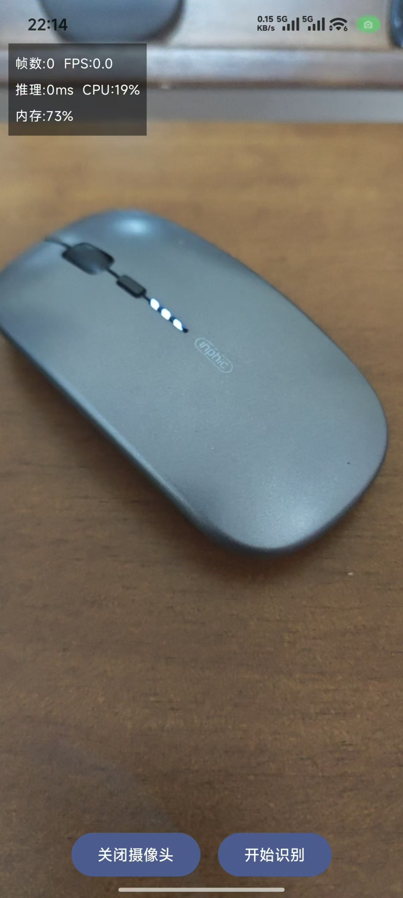
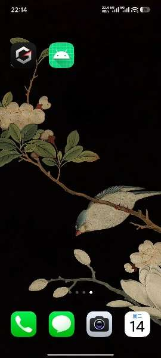
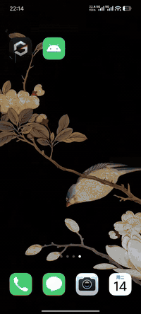

# ZVisionEdge

Android 端侧智能识别应用，基于 YOLOv8 ONNX 模型和 ONNX Runtime 实现实时物体检测，无需联网，数据不出设备。

> 本项目由 AI Coding 辅助开发 — 从项目脚手架、YOLO 推理管线、CameraX 集成到 UI 布局，核心代码生成均由 Claude Code 驱动。

## 特性

- **完全端侧运行** — 基于 Microsoft ONNX Runtime，推理在本地完成，不依赖云端服务
- **实时检测** — CameraX 3 摄像头流水线，YUV 图像直通推理引擎
- **80 类物体识别** — 基于 COCO 数据集（中文标签）
- **性能监控** — 实时显示 FPS、推理耗时、CPU 占用、系统内存
- **可配置抽帧** — 通过 `config.yml` 调整跳帧策略，平衡性能与功耗
- **动态主题** — Material 3 + Android 12 动态取色，支持明暗模式
- **NMS 后处理** — 按类别独立执行非极大值抑制，避免跨类误杀

## 演示

<table>
  <tr>
    <td align="center"><br>未识别状态</td>
    <td align="center"><br>已识别状态</td>
    <td align="center"><br>操作演示</td>
  </tr>
</table>

## 架构

```
┌─────────────────────────────────────────────────────┐
│ MainActivity (Single Activity)                       │
│ ┌───────────────────────────────────────────────────┐ │
│ │ CameraScreen (Compose UI)                         │ │
│ │ ┌──────────────┐ ┌──────────────────────────────┐ │ │
│ │ │ CameraX       │ │ YoloDetector                 │ │ │
│ │ │ Camera2       │ │  ├─ Preprocessor  (YUV→RGB)  │ │ │
│ │ │ ImageAnalysis │ │  ├─ ONNX Runtime  (推理)     │ │ │
│ │ │ (YUV frames)  │ │  └─ Postprocessor (NMS)      │ │ │
│ │ └──────────────┘ └──────────────────────────────┘ │ │
│ │ ┌──────────────────────────────────────────────┐   │ │
│ │ │ PerformanceMonitor (FPS / CPU / 内存)         │   │ │
│ │ └──────────────────────────────────────────────┘   │ │
│ └───────────────────────────────────────────────────┘ │
└─────────────────────────────────────────────────────┘
```

| 组件 | 职责 |
|------|------|
| `CameraController` | CameraX 生命周期绑定，YUV_420_888 帧采集 |
| `Preprocessor` | YUV→RGB 位图转换与尺寸缩放 |
| `YoloDetector` | ONNX Runtime 模型加载与推理 |
| `Postprocessor` | 置信度过滤 + 按类别 NMS |
| `PerformanceMonitor` | /proc/self/stat 进程 CPU 读取，ActivityManager 系统内存获取 |
| `ConfigLoader` | assets/config.yml 运行时参数加载 |

## 快速开始

### 环境要求

- Android Studio 2025+
- Android SDK 36
- JDK 17
- Gradle 9.1.1+

### 构建

```bash
git clone https://github.com/zhouyp001/ZVisionEdge.git
cd ZVisionEdge
./gradlew assembleDebug
```

将 APK 安装到 Android 16 及以上设备即可运行。

### 配置抽帧

编辑 `app/src/main/assets/config.yml`：

```yaml
# 抽帧配置: 0=每帧处理, 1=隔1帧, 2=隔2帧...
frame_skip: 30
```

数值越大，推理频率越低，更省电；但对移动物体检测延迟更高。

## 技术栈

| 技术 | 版本 | 用途 |
|------|------|------|
| Kotlin | 2.2 | 开发语言 |
| Jetpack Compose | 2026.02 BOM | UI 框架 |
| CameraX | 1.3.0 | 摄像头采集 |
| ONNX Runtime | 1.18.0 | 模型推理引擎 |
| YOLOv8n | ONNX | 物体检测模型（~13MB） |
| Material 3 | — | 动态主题 |

## 性能数据

YOLOv8-nano 在骁龙 8 Gen 3 上的表现（640×640 输入）：

| 指标 | 数值 |
|------|------|
| 推理耗时 | ~25ms/帧 |
| 最大检测帧率 | ~40 FPS |
| 模型大小 | 13 MB |

> 通过 `frame_skip` 抽帧配置可进一步降低 CPU 负载和功耗。

## 项目结构

```
app/src/main/java/com/zhouyp/visionedge/
├── MainActivity.kt              # 单 Activity 入口
├── camera/
│   └── CameraController.kt      # CameraX 封装
├── detection/
│   ├── AppConfig.kt             # 运行时配置加载
│   ├── CocoClasses.kt           # COCO 80类中文标签
│   ├── Detection.kt             # 检测结果数据类
│   ├── PerformanceMonitor.kt    # 性能指标采集
│   ├── Postprocessor.kt         # 置信度过滤 + NMS
│   ├── Preprocessor.kt          # 图像预处理
│   └── YoloDetector.kt          # ONNX Runtime 推理
└── ui/
    ├── screen/
    │   └── CameraScreen.kt      # 相机预览 + 检测叠加
    └── theme/
        ├── Color.kt
        ├── Theme.kt
        └── Type.kt
```

## 许可证

MIT License — 详见 [LICENSE](LICENSE)
